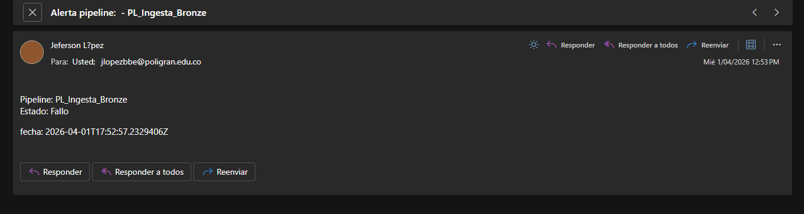
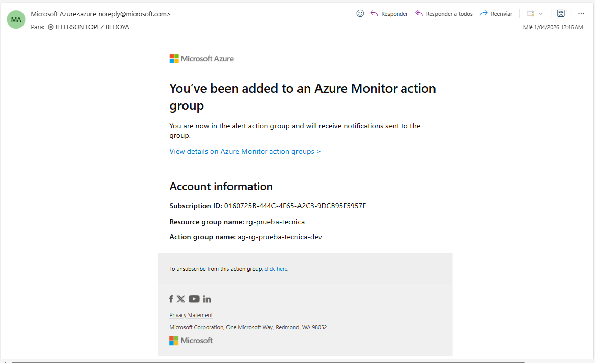
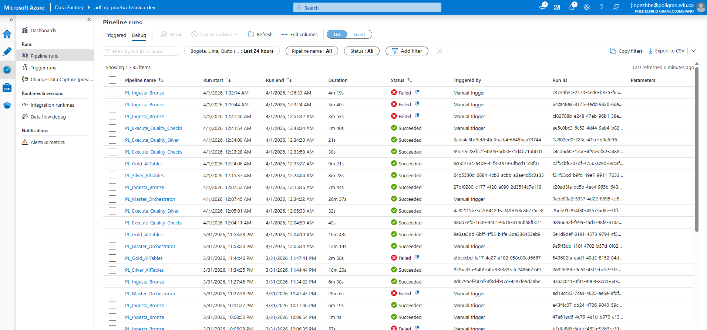

# 🚀 Prueba Técnica Ingeniero de Datos – Escenario D (Logística)

## 1. Selección del escenario y plataforma

**Escenario elegido:** D – Logística y Cadena de Suministro  
**Plataforma cloud:** Microsoft Azure  

### Justificación
Azure ofrece servicios gestionados como:
- Azure SQL Database  
- Data Lake Storage Gen2  
- Data Factory 

Esto permite construir una solución **escalable, segura y con gobierno de datos integrado**.

---

## 2. Fase 1 – Generación de datos sintéticos

### 2.1 Herramientas utilizadas

- **Python 3.12**
- Librerías:
  - `pandas`, `numpy` → manipulación de datos
  - `Faker` → datos realistas
  - `hashlib` → enmascaramiento
  - `pyyaml` → configuración
 
- Entorno Virtual: Spyder 6

**Formato de salida:** CSV y Parquet

---

### 2.2 Configuración de generación

Archivo `config.yaml`:

```yaml
seed: 42
date_range:
  start: "2024-01-01"
  end: "2024-12-31"
output_formats: ["csv", "parquet"]

volumes:
  OPE_CONDUCTORES: 500
  CLI_REMITENTES: 200
  GEO_ZONAS: 300
  TMS_ENVIOS: 2000000
  GPS_RUTAS: 100000
  CAL_DESTINATARIOS: 300000
  DIR_NOVEDADES: 150000

anomalies:
  duplicate_rate: 0.001
  null_rate: 0.05
  out_of_range_rate: 0.001
  referential_integrity_violation_rate: 0.005
```

---

### 2.3 Carga en Azure SQL Database

- Base de datos: `prueba_tecnica`
- Herramientas:
  - `pymssql`
  - `SQLAlchemy`
- Credenciales almacenadas en `.env` (no versionado)

---

### 2.4 Evidencias

- Diagrama Entidad-Relación  
- Verificación de conteos  

---

## 3. Fase 2 – Infraestructura como Código (Terraform)

### Recursos aprovisionados

- Resource Group: `rg-prueba-tecnica`
- Storage Account (ADLS Gen2):
  - `bronze`
  - `silver`
  - `gold`
- Azure Data Factory  
- Azure Databricks  
- Azure Key Vault  
- Log Analytics Workspace  
- Action Group  

---

### Justificación

- Infraestructura **declarativa y versionada**
- Backend remoto en Azure Storage
- Soporte para múltiples entornos (dev/prod)

---

### Instrucciones de despliegue

```bash
az login
cp terraform.tfvars.example terraform.tfvars
terraform init
terraform plan
terraform apply
```

---

### Evidencias

- Salida de `terraform apply`
- Recursos en Azure Portal

---

## 4. Fase 3 – Pipeline Medallion

### 4.1 Arquitectura

#### 🥉 Bronze
- Ingesta incremental desde Azure SQL
- Formato: Parquet
- Particionado: año/mes/día
- Auditoría:
  - `batch_id`
  - `ingest_timestamp`
  - `source_system`

#### 🥈 Silver
- Limpieza y deduplicación
- Manejo de nulos
- Enmascaramiento (SHA-256)
- Validaciones
- Errores → `silver/errors/`
- Reporte → `silver/logs/quality_report.csv`

#### 🥇 Gold
Modelo analítico:

- **Dimensiones**
  - `dim_conductores`
  - `dim_remitentes`
  - `dim_zonas`

- **Hechos**
  - `fact_envios`
  - `fact_rutas`
  - `fact_desempeno_conductor`
  - `fact_trazabilidad_envio`
  - `fact_alertas_zona`

---


## 5. Fase 4 – Orquestación

- **Pipeline maestro**: `PL_Master_Orchestrator` ejecuta en serie los pipelines de Bronze, Silver, Gold y calidad.
- **Programación**: trigger diario a las 02:00 (hora local).
- **Reintentos**: 3 intentos con backoff exponencial en cada actividad.
- **Alertas**: 
  - Fallo: se envía correo al Action Group (`ag-rg-prueba-tecnica-dev`).  
    
  - Éxito: también se envía correo de resumen (alerta de métrica).  
    
- **Monitoreo**: dashboard con historial de ejecuciones.  
  
- **Código**: definición del pipeline en [`pipelines/Export All Code/diagnostic.json`](pipelines/Export All Code/diagnostic.json).
